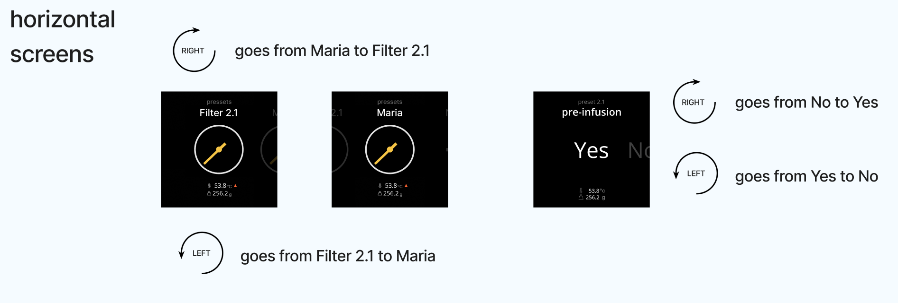
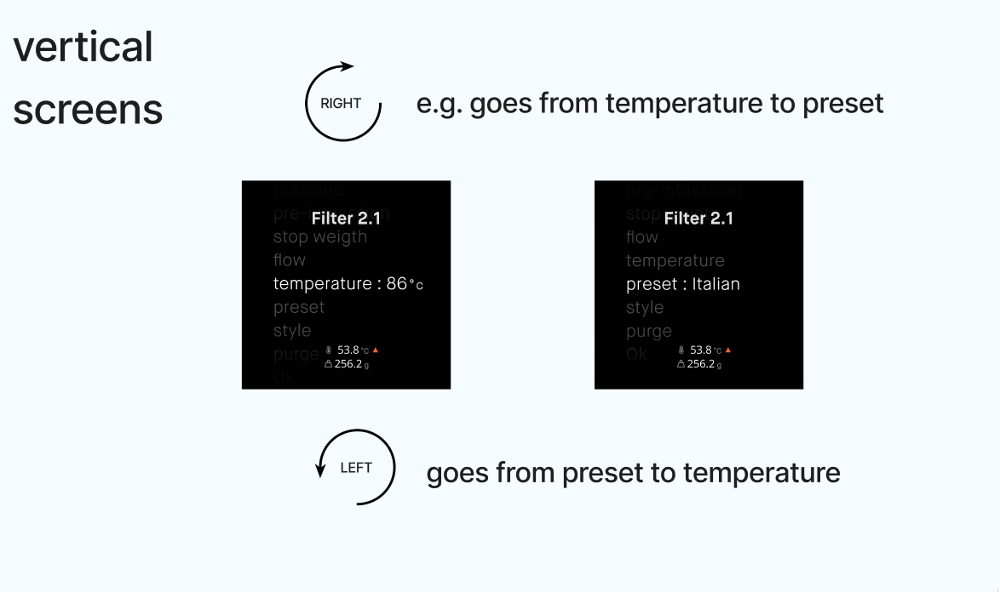
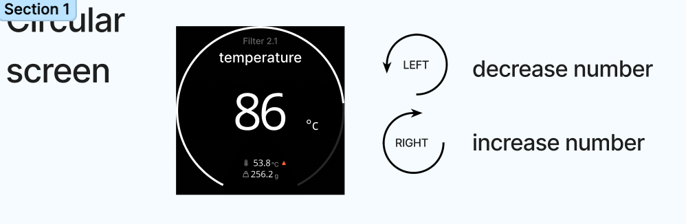
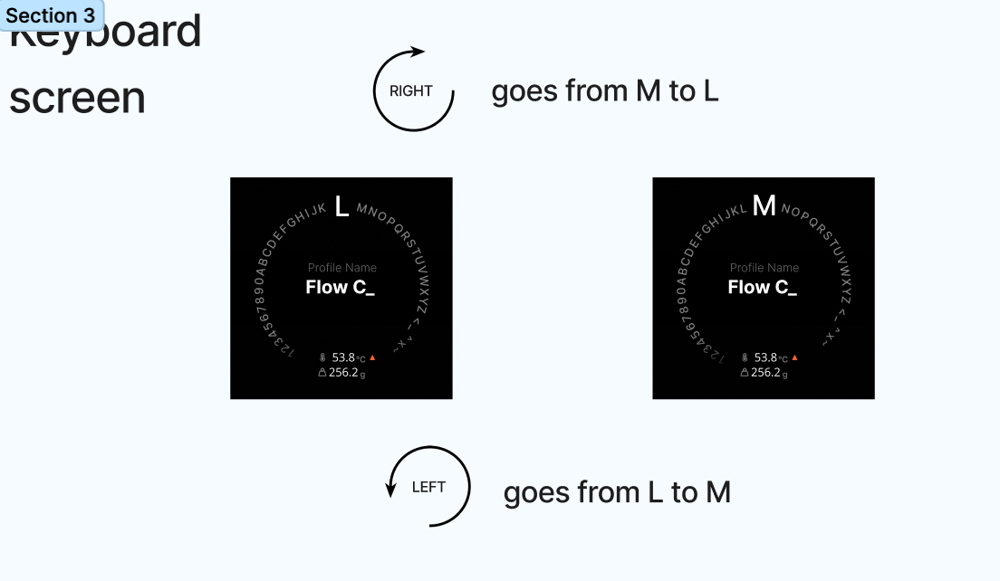

# Meticulous UI

## 1. Start up

### Install Dependencies

```bash
npm install
```

Note: you will need to have installed NodeJS v18 or later

### Run dev mode

```bash
npm run start
```

## 2. Code conventions

We are using [Commitizen](http://commitizen.github.io/cz-cli/) and [Commitlint](https://commitlint.js.org/#/) to provide meaningful commits

### Formatter

We are using [Prettier](https://prettier.io/) to keep code in a standard way.

```bash
# Format the files exists
$ npm run format
```

### Make a commit

When you are ready to commit, run

```bash
$ npm run commit
```

We use the follow [structure](https://commitlint.js.org/#/concepts-commit-conventions)

```
type(scope): subject
```

## 3. How Dial Works

### Gestures

Dial has only 3 actions that we can catch from it. `Turn Left`, `Turn Right` and `Click`.


### Conventions

_Horizontal screens_



_Vertical screens_



_Circular screens_



_Keyboard screen_



### Behaviour

Based on the [gesture](#gestures), we need to use them into each state in a specific way. For instance, when the state is `showing barometer`, we have the three gestures available. On the other hand, when state is `showing scale`, we just have available the gesture **double tare**.

> **Note:** _double tare_ gesture comes from an extra hardware element.


## 4. Events

We react to different button events coming from controller. We have mapped every button to a keyboard event for testing. See SocketProviderValue.ts.

