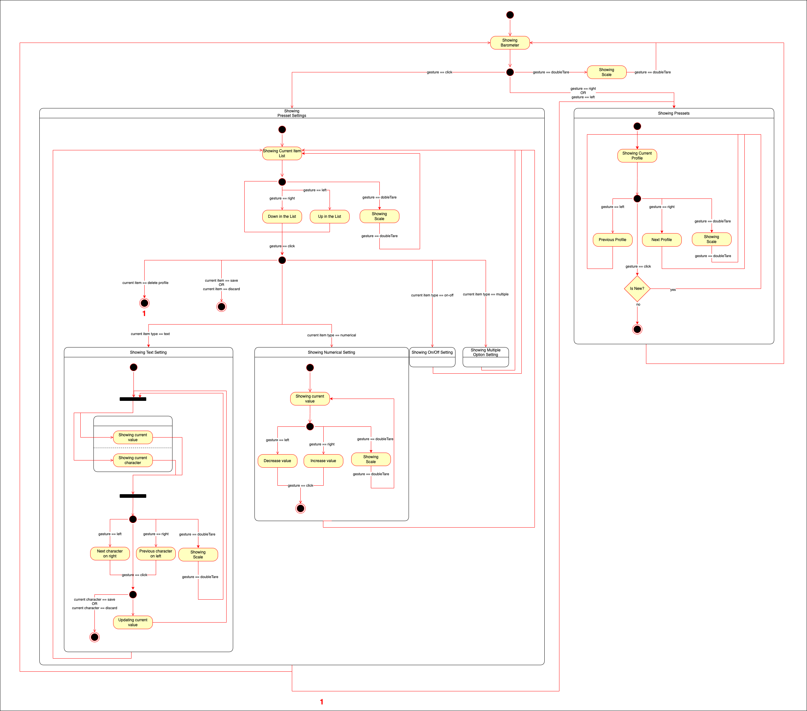

# Meticulous UI

## Start up

### Install Dependencies

```bash
npm install
```

### Run dev mode

```bash
npm run start
```

Note: you will need to have installed NodeJS v16.15.1 or major

## Code conventions

We are using [Commitizen](http://commitizen.github.io/cz-cli/) and [Commitlint](https://commitlint.js.org/#/) to provide commits meanfuls

## Formatter

We are using [Prettier](https://prettier.io/) to keep code in a standard way.

```bash
# Format the files exists
$ npm run format
```

## Make a commit

When you are ready to commit, run

```bash
$ npm run commit
```

We use the follow [structure](https://commitlint.js.org/#/concepts-commit-conventions)

```
type(scope): subject
```
---
## How Dial Works

### Gestures
Dial has only 3 actions that we can catch from it. `Turn Left`, `Turn Right` and `Click`.


### Behaviour
Based on the [gesture](#gestures), we need to use them into each state in a specific way. For instance, when the state is `showing barometer`, we have the three gestures available. On the other hand, when state is `showing scale`, we just have available the gesture **double tare**.

> **Note:** _double tare_ gesture comes from an extra hardware element.




---

## Events

We react to different keyboard events coming from controller. We have mapped every keyboard event triggered. You can check out it in the following [file](https://github.com/FFFuego/backend_for_esp32/blob/main/back.py#L122)


---

## Preset File

Each preset is store in a JSON file under per-user application data directory. See the documentation [here](https://github.com/electron/electron/blob/main/docs/api/app.md#appgetpathname).

Following, we have the JSON structure we define to allow app to process the preset values.

### JSON schema
```json
[
    {
        "presetId": "string",
        "settings": [
            {
                "id": "number",
                "type": "enum", // "text" | "numerical" | "on-off" | "multiple-option",
                "key": "string", // it acts as a unique identifier
                "label": "string",
                "value": "number" | "string",
                "unit": "enum", // "c°" | "g" | "bar"
                "hidden": "boolean" // if it is true, it must not be displayed. Default: false
            },
            .
            .
            .
        ]
    },
    .
    .
    .
]
```

For more information about it, see the following [file](https://github.com/PrivSocial/meticulous-ui/blob/master/src/types/index.ts).