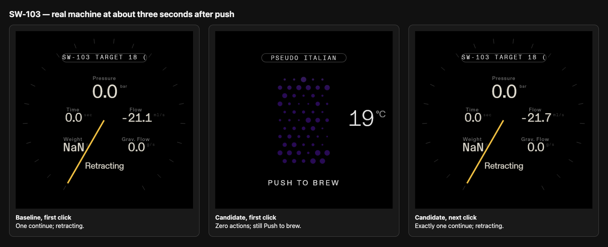
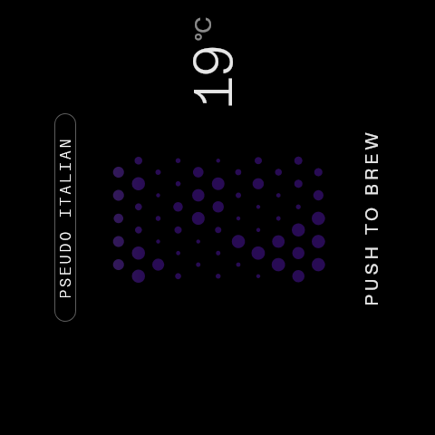
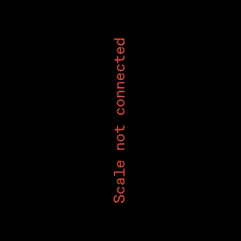
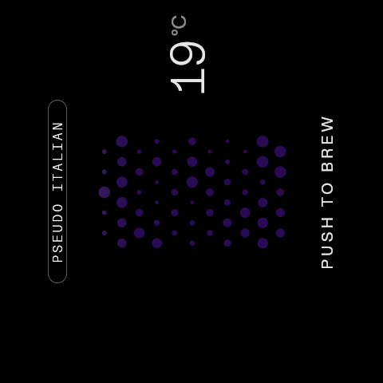
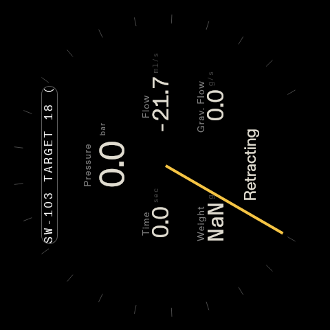

# Fullscreen scale dismissal evidence

## Real machine comparison

This is the primary evidence for SW-103. On 2026-09-05 UTC, the same temporary
18 °C profile with `auto_start_shot=false` ran on the dedicated lab machine
against these installed Dial binaries:

- baseline: SHA-256
  `ea373a70e7c231ac9acd4db11cfea1b247f283b4864c5e61ae9af64dd8706d8c`;
  the source revision of this previously installed lab binary is unknown;
- candidate: commit `2aa4dc8c062642803be250aaa78375c87cb9887e`,
  binary SHA-256
  `d56fc14ace594a6bc33c063f1f56fd687a42e322af4716fcea147550525a680a`.

The decisive frames were requested from the recorded push-write completion,
not after the immediate screenshot finished. The actual offsets were 3.041446 s
for the baseline first click, 3.046872 s for the candidate first click and
3.097229 s for the candidate second click.

| Gesture                          | Baseline binary                                                           | Candidate binary                                                                             |
| -------------------------------- | ------------------------------------------------------------------------- | -------------------------------------------------------------------------------------------- |
| Full Scale before first click    |            |                             |
| First click, immediate           |  |                   |
| First click, about +3 s          |   |         |
| Candidate next click, about +3 s | —                                                                         |  |

The summary image is a browser rendering of the
[downloadable HTML/CSS comparison source](real-machine/comparison.html). The raw
480×480 Weston PNGs are unchanged and retain the display's 90-degree output
transform; the comparator rotates them for viewing without editing their pixels.

The baseline first click emitted one `continue` action and reached
`name=retracting`. The candidate first click emitted zero actions and remained
`name=click to start`, `state=brewing`, `extracting=false`; its next click emitted
exactly one `continue` and reached `name=retracting`. The complete minimal
timelines are the [baseline trace](real-machine/baseline/trace.jsonl) and
[candidate trace](real-machine/candidate/trace.jsonl). They contain only button,
status, action and capture events; machine hostname and unrelated logs were
removed. [Run metadata](real-machine/run-metadata.json) and
[SHA-256 manifest](real-machine/SHA256SUMS) identify every committed artifact.

The input harness sent `TARE_PRESSED`/`TARE_RELEASED` and
`ENCODER_PRESSED`/`ENCODER_RELEASED`/`ENCODER_PUSH` through the backend's debug
emulator to Dial's production Socket.IO button listener. It never invoked
`continue` directly. The observer recorded all eight candidate button events
and all five baseline button events, and the backend journal independently
recorded the resulting action count. The machine configuration, backend source,
Weston configuration and candidate Dial binary were restored and verified after
the run; the final machine state was `idle`/`idle`, `extracting=false`.

The lab scale reported `Scale not connected`. This run validates the installed
Dial gesture boundary and resulting machine status/action path. It does not
validate the encoder's electrical path, load-cell/tare integration, long press,
double press or reconnect behavior.

## Component regression fixture

The earlier Playwright scenario runs against source baseline `ce0148ed` and the
final Scale implementation. The reviewed candidate source snapshot is
`7c3803f`; publication commit `402877d` has the identical Git tree. Both use
Node 22.23.2, Playwright 1.62.1, Chrome 152.0.7977.82, 480×480, 93 °C and a
synthetic weight of 18.5 g.

The fixture uses the actual Scale, HeatingScreen, gesture hook and continue
action. Settings, profile context and socket output are simulated; it does not
mount the full App/Router, run a machine backend or operate a physical machine.
Its immediate screenshots both show Push to brew and do not demonstrate the
resulting machine behavior.

| State               | Source baseline                                               | Fix                                                     |
| ------------------- | ------------------------------------------------------------- | ------------------------------------------------------- |
| Push to brew        |  |  |
| Fullscreen scale    |      |      |
| Immediate dismissal |        |        |

The fullscreen fixture captures are byte-identical, SHA-256
`222d516cc57c7db93dfa515802311bbe2a4a68782276eee9748d206871e62d8a`.
[Baseline events](before/events.json) show the dismissing click reaching the
underlying screen; [candidate events](after/events.json) show no action on
dismissal and exactly one action on the next press.

Run the fixture with
`npm run test:scale-overlay -- --grep 'fullscreen dismissal'`. See the
[suite documentation](../../scale-overlay.md) for the 17-case regression
coverage and [ARM64 smoke plan](../../sw-103-arm64-smoke.md) for the broader
physical checklist.
