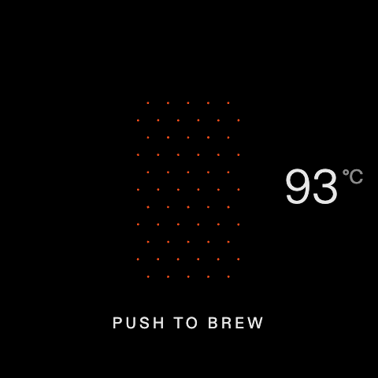
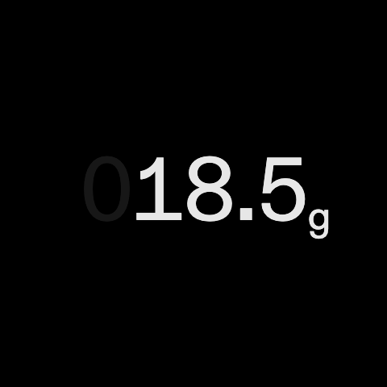
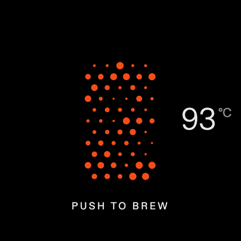
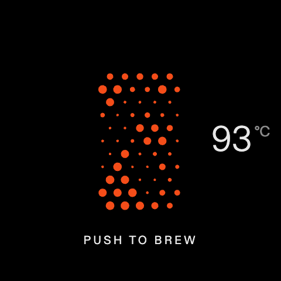

# Fullscreen scale dismissal evidence

The same Playwright scenario runs against baseline `ce0148ed` and the final
Scale implementation. The reviewed source snapshot is `7c3803f`; the publication
commit `402877d` has the identical Git tree. Both use Node 22.23.2, Playwright
1.62.1, Chrome 152.0.7977.82, 480×480, 93 °C and a synthetic weight of 18.5 g.

The fixture uses the actual Scale, HeatingScreen, gesture hook and continue
action. Settings, profile context and socket output are simulated; it does not
mount the full App/Router, run a machine backend or operate a physical machine.
Screenshots alone cannot prove action suppression, since the recorded command
does not start a shot in this fixture. The orange animation may be at different
frames in the two captures.

| State            | Baseline                                            | Fix                                               |
| ---------------- | --------------------------------------------------- | ------------------------------------------------- |
| Push to brew     |  |  |
| Fullscreen scale |      |      |
| After dismissal  |        |        |

The fullscreen captures are byte-identical, SHA-256
`222d516cc57c7db93dfa515802311bbe2a4a68782276eee9748d206871e62d8a`.

- [Baseline events](before/events.json): down closes Scale; the subsequent
  up/click reaches the underlying screen and emits `action,continue`. The test
  fails at that assertion and does not send another press.
- [Fix events](after/events.json): down/up/click closes Scale with no underlying
  events or actions. The next complete press delivers down/up/click and exactly
  one `action,continue`.

These traces contain only the synthetic scenario's gestures, visibility,
underlying delivery and action calls. Timestamps are relative to the first
encoder press. No machine/customer logs are included.

Run the scenario with `npm run test:scale-overlay -- --grep 'fullscreen dismissal'`.
See [suite documentation](../../scale-overlay.md) for the full 17-case regression
coverage and [ARM64 smoke plan](../../sw-103-arm64-smoke.md) for remaining physical
verification. This evidence establishes the component regression, not field
resolution or native display behavior.
